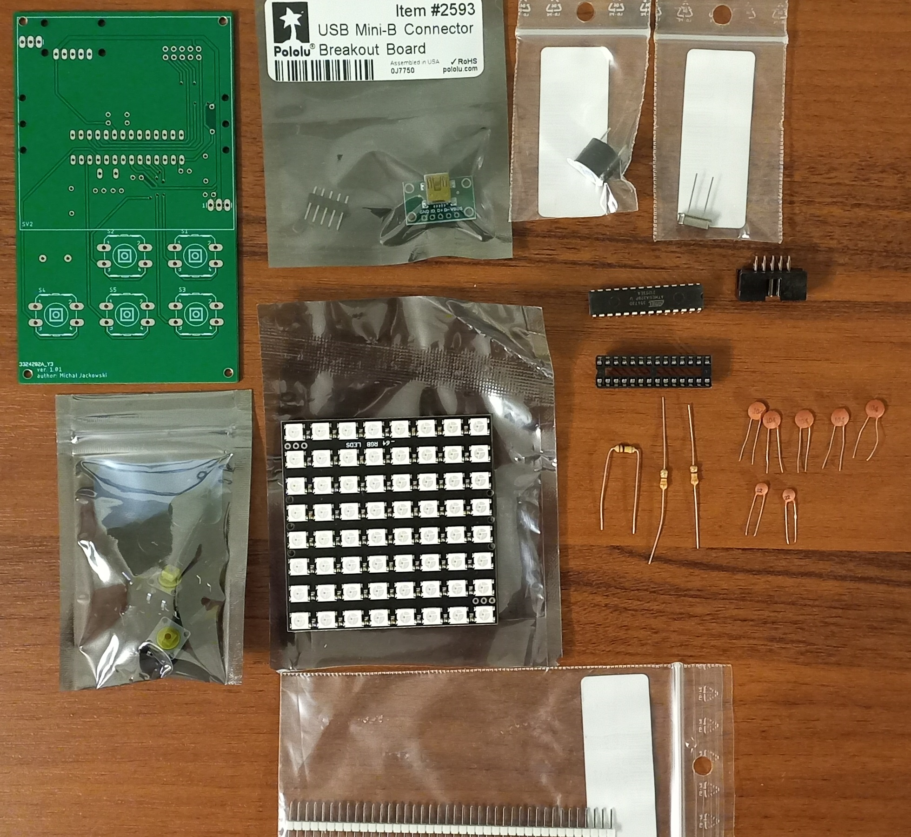

# **Snake game on AVR**

The aim of my project was to create a device that allows you to play the popular game `"Snake"`. I completed the project as part of a university subject. While creating it, I used my original snake game written in C++ for Windows (graphics shown in the command line). I was prototyping the Arduino version. Then I rewritten the whole project into C language on the AVR microcontroller (ATmega328P). 

# **Game Demo**

<iframe width="560" height="315" src="https://www.youtube.com/embed/W63zcMBPLeU" title="YouTube video player" frameborder="0" allow="accelerometer; autoplay; clipboard-write; encrypted-media; gyroscope; picture-in-picture" allowfullscreen></iframe>

# **Elements used in the project:**
* RGB matrix 8 x 8 WS2812B
* 5 microswitches
* Buzzer HCM1206X
* ATmega328P
* USB as power supply
* custom board (All eagle files is in resources folder)
* necessary RC elements (all information about values ​​is in the schematics)

# **PCB**

# **IMPORTANT**

in the resources folder there are hex files for both versions of the project (Arduino and AVR). Please note that the AVR version only works for frequencies based on the internal RC oscillator (Set fuse bits on 8Mhz). The prototype version from arduino uses an external crystal oscillator (then you have to change the fuse bits to the external 16 MHz clock). This limitation is due to the [**`light_ws2812`**](https://github.com/cpldcpu/light_ws2812) library that I am using in the project.